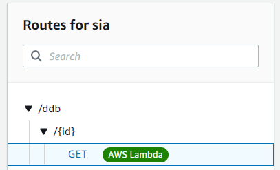

# JavaScript AWS Assignments

# Ex. 1 File Upload/Download via AWS CLI
Upload a file using the following naming schema: `upload-file-stu{studentid}.txt` to the following bucket: `siu-avb-bucket`.  Once the file has been uploaded to AWS, use the AWS CLI to return a list of files in this bucket.  Then download the file from AWS using the following naming schema: `download-file.txt`.

# Ex. 2 File Upload/Download via SDK
### Part A Boto3
Create a new Python project that uploads and downloads a txt file using Boto3.  Use the [Python Reference](https://gitlab.com/mburolla/python-reference/-/blob/main/s3-ref.py) as a guide.  Upload this project to a new public repo in YOUR GitHub account.  Create a simple Readme.md doc that briefly describes the repo.

### Part B JavaScript aws-sdk
Create a new Node project that uploads and downloads a txt file using the JavaScript aws-sdk (`const AWS = require('aws-sdk')`). Upload this project to a new public repo in YOUR GitHub account.  Create a simple Readme.md doc that briefly describes the repo.

# Ex. 3 IAM Policy Lambda
Create a Lambda function that contains the following code:

```
var AWS = require('aws-sdk');

const S3 = new AWS.S3({region: 'us-east-1'});

exports.handler = async (event) => {
    const b = { firstName: "Joe", lastName: "Smith" };
    const buffer = Buffer.from(JSON.stringify(b), "utf-8");
    await S3.upload({ Bucket: 'siu-avb-bucket', Key: 'joe.txt', Body: buffer }).promise();
    return "ok";
};

```

Name your function using the following schema: `sia-{your initials}-upload-s3`

Create a managed policy and attach it to the execution role for your lambda function.  This new policy must provide write access to this bucket.

# Ex. 4  IAM Bucket Policy
Create a bucket policy that only allows you to upload a file from your home computer and attach it to your student bucket.

# Ex. 5 API GW
Create a POST route with the following schema: `/{STUDENT_ID}/upload`.  Create a Lambda integration that calls a Lambda file to upload a file to S3.  Attach the Lambda integration to this Route, deploy the API, and call this route using Postman.

# Ex. 6 DynamoDB Write
Create an Express web API with the following endpoint:

```
POST http://localhost:5150/customer
```

The endpoint accepts the following data and stores it into a Customer table in DynamoDB
```
{
    "customerId": <YOUR STUDENT ID>,
    "firstName": "Paul", 
    "lastName": "Simmon",
    "age": 54, 
    "zip": 23111
}

```

# Ex. 7 DynamoDB Read

Update the Express web API in Ex. 7 with the following new endpoint:

```
GET http://localhost:5150/customer/{YOUR STUDENT ID}
```

This endpoint returns all the information for this customer from DynamoDB.

Example:
```
{
    "zip": 23111,
    "firstName": "Paul",
    "lastName": "Simmons",
    "customerId": 7,
    "age": 54
}
```

# Ex. 10 Lambda
Create a lambda function that returns the contents of the event object.  Copy and paste the JSON response in `http://jsonviewer.stack.hu` and view as a tree.

# Ex. 11 Lambda --> DDB
Create a Lambda function that returns the first name of a customer from the DynamoDB Customer table.

# Ex. 12 API GW --> Lambda --> DDB
Create the following endpoint using the API Gateway:

```
/student<YOUR ID HERE>/ddb/{id}
```



This endpoint connects to a lambda function that returns the first name for a customer in the Customer table.

URL:
```
GET https://js48lhu1t0.execute-api.us-east-1.amazonaws.com/dev/student1/ddb/7
```

Output:
```
Paul
```

To test your lambda function without using the API GW, use the following test event:
```
{
 "pathParameters":{"id":"<VALID CUSTOMER ID HERE>"}
}
```
