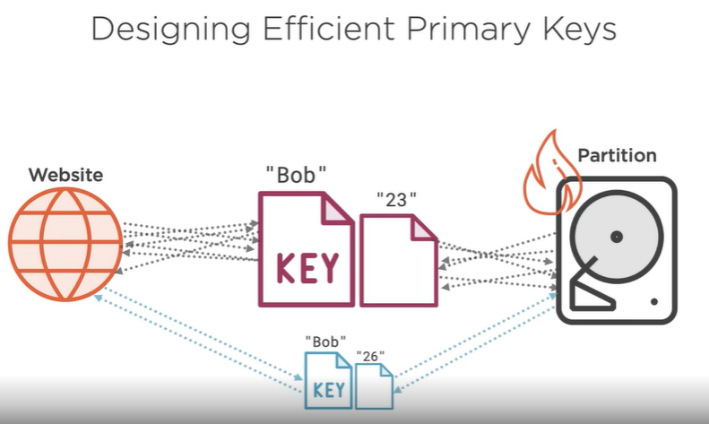
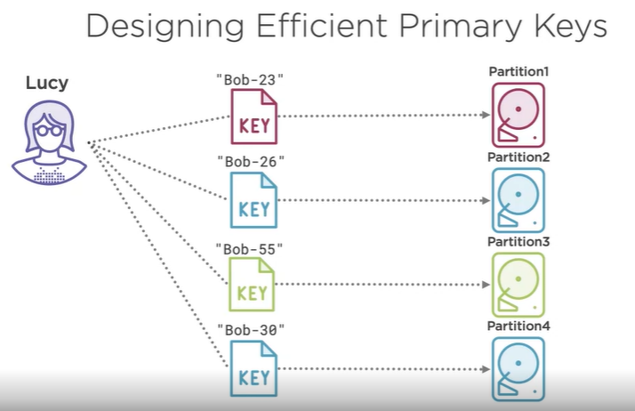
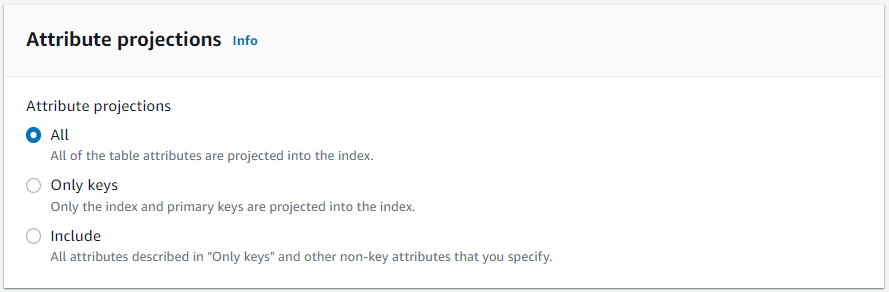

# DynamoDB
- [AWS DynamoDB Fundamentals ~2h (Skip 4 & 5)](https://app.pluralsight.com/library/courses/aws-dynamodb-fundamentals/table-of-contents) (UI is old)
- [Best Practice](https://docs.aws.amazon.com/amazondynamodb/latest/developerguide/best-practices.html)
- [Anatomy of an Item](https://www.dynamodbguide.com/anatomy-of-an-item/)
- [JSON to DynamoDB JSON Tool](https://dynobase.dev/dynamodb-json-converter-tool/#:~:text=DynamoDB%20Converter%20Tool,a%20DynamoDB%2Dcompatible%20JSON%20format.)

# Three Ways to Read/Write with DynamoDB
- [Native](https://docs.aws.amazon.com/amazondynamodb/latest/developerguide/WorkingWithItems.html)
- [Document Client](https://docs.aws.amazon.com/sdk-for-javascript/v2/developer-guide/dynamodb-example-document-client.html) ([DynamoDB Client - AWS SDK for JavaScript v3](https://docs.aws.amazon.com/AWSJavaScriptSDK/v3/latest/clients/client-dynamodb/))
- [PartiQL](https://docs.aws.amazon.com/amazondynamodb/latest/developerguide/ql-reference.statements.html)


# DynamoDB Datatypes
- [DataTypes](https://docs.aws.amazon.com/amazondynamodb/latest/developerguide/DynamoDBMapper.DataTypes.html)
- All Numbers: "N"
- Strings: "S" (Useful for storing documents `JSON.parse()`, `JSON.stringify()`)
- Document (Multiple values of different types) "BOOL"
- Set  (Multiple values of the same type) "SS", "NS", "BS"
- List (arrays []) "L"
- Map  (dictionary {}) "M"
- When reading/writing from/to DynamoDB using the native approach, we must specify the data types in our data.  For example:

```
{
    "Name": { "S": "Alex DeBrie" },
    "Age": { "N": "29" },
    "Roles": { "L": 
        [
            { "S": "Admin" }, 
            { "S": "User" }
        ]
    },
    "map" : { 
        "M": {
            "age" : {
                "N": "55"
            }, 
            "name" : {
                "S": "Peter"
            }
        }
    }
}
```

However when using the `DocumentClient`, we can avoid specifying the data types in our data:

```
const params = {
    TableName: TABLE_NAME,
    Item: item // <== Can be any JavaScript flat object.
};
await ddbc.put(params).promise();

```

# Design Considerations
- DynamoDB works best as a flat document store with simple queries in the where clause (querying the primary or sort key)
- Table scans can be avoided by creating indexes for the target fields on a table
- If your scenario requires heavily nested data and complex queries, a relational DB is probably a better choice
- It is not possible to join tables with DynamoDB/PartiQL
- To avoid a hot partition, design your partition key to include target attributes.





Sort Key is useful for:
- starts with
- between
- greater than
- less than

When creating an index, only include the Attribute Projections that you need:



# DynamoDB Proxy
These files in this repo show the three ways to interact with DynamoDB:
- [Client](./ddb/test.js)
- [DDB-Proxy](./ddb/ddb-proxy.js)

# Querying
- [Native DDB](https://docs.aws.amazon.com/amazondynamodb/latest/developerguide/GettingStarted.NodeJs.04.html)
- [PartiQL](https://abba.dev/blog/dynamodb-partiql-javascript)
- [Examples](https://www.fernandomc.com/posts/eight-examples-of-fetching-data-from-dynamodb-with-node/)

#### PartiQL & DynamoDB
DynamoDB supports a subset of the official PartiQL specification.  For example, the `like` keyword and `join` operations are not supported in DynamoDB.

[Statements](https://docs.aws.amazon.com/amazondynamodb/latest/developerguide/ql-reference.statements.html)
[Functions](https://docs.aws.amazon.com/amazondynamodb/latest/developerguide/ql-functions.html)

Statements
- Select
- Update
- Delete
- Insert

Functions
- Exists
- Begins_with
- Missing
- Attribute_type
- Contains
- Size


#### Table Scan
A DynamoDB table has two keys:
- Primary Key
- Sort Key

The Sort key can be thought of as a secondary key (composite key) to help provide uniqueness in your table.

Table scans can consume HUGE amounts of read capacity and hinder the performance of your application.  Shadow tables (copies) are useful for business queries that will not impact the user experience.

Avoid table scans by creating indexes for the field in your where clause.  The pricing details of an index is the same for tables.

```
Using the SELECT statement can result in a full table scan if an equality condition with a partition key is not provided in the WHERE clause.
```
Querying an Index:
```
SELECT * FROM "Customer"."firstName-index" where firstName = 'Tom'
```

Full table scan (the primary key is customer id):
```
SELECT * FROM "Customer" where firstName = 'Tom'
```

Return capacity units for full table scan (also visible in the web console):
```
aws dynamodb scan --table-name Customer --return-consumed-capacity INDEXES

"ConsumedCapacity": {
    "TableName": "Customer",
    "CapacityUnits": 0.5,
    "Table": {
        "CapacityUnits": 0.5
    }
}
```

Paging
```
aws dynamodb scan --table-name Customer --return-consumed-capacity INDEXES --page-size 100
```

Can also query index name:
```
aws dynamodb scan --table-name Customer --index-name firstName-index --return-consumed-capacity INDEXES
```

# Capacity Units
- Write Capacity Unit (WCU): 1 write operation per second of 1KB
- Read Capacity Unit (RCU): 1 or 2 read operations per second of 4KB
  - Eventual consistency $ (reading data before it has been throughly stored - dirty reads)
  - Strong consistency $$$ (reading the most up-to-date data after being replicated)
