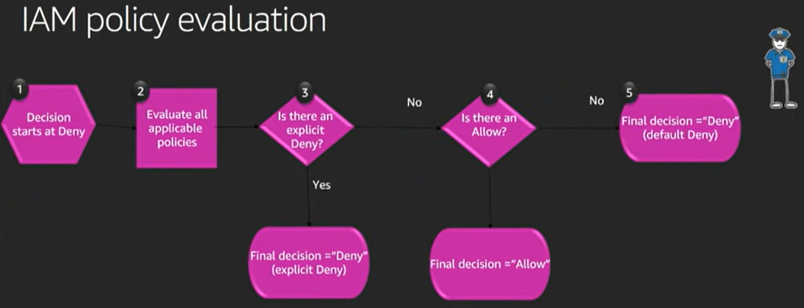

# IAM
- [AWS IAM Core Concepts You NEED to Know 20m](https://youtu.be/_ZCTvmaPgao)
- [AWS re:Invent 2018 1hr](https://youtu.be/YQsK4MtsELU)
- [Identity and Access Management on AWS: Policies and Permissions 2h 21m](
https://app.pluralsight.com/library/courses/identity-access-management-aws-policies-permissions/table-of-contents)
- [AWS IAM Tutorial - How to Create a User and Policy 5m](https://youtu.be/dMPDZHVIZBs)
- [AWS IAM Overview in 7 minutes | Beginner Overview 7m](https://youtu.be/y8cbKJAo3B4)

# Policy Types
- AWS Managed
- Customer managed
- Inline 

# Authorization vs Authenication
Authenication is proving who you say you are, authorization is what you are allowed access to after you have successfully authenticated.  IAM policies focus on authorization.

## PARC Model
A policy is a JSON document.

```
{
  "Statement" :[{
      "Effect": "effect",  (Allow/Deny)
      "Principal":"principal", (the who or what)
      "Action":"action", 
      "Resource":"arn", (the thing)
      "Condition": {
          "condition": {
              "key": "value"
          }
      }
  }]
}
```

# Principal
The entity that is allowed or denied access (AKA "the who or what") 

- You may not see the principal often, because we attach policies to existing principals (IAM User or Role) most of the time.
- When attaching a policy to a bucket we will need to specify the principle (the who)

[All Types of Principals](https://docs.aws.amazon.com/IAM/latest/UserGuide/reference_policies_elements_principal.html)

Common types of principals:

#### Any Principal
```
"Principal" : { "AWS" : "*" }
```

#### Service Principal 
Click [here](service-principals.md) for a list of AWS services.

```
"Principal": {
    "Service": [
        "ec2.amazonaws.com",
        "lambda.amazonaws.com"
   ]
}
```

#### IAM User Principal
```
"Principal":{
    "AWS":"arn:aws:iam::account-number-without-hyphens:user/username"
}
```

#### IAM Role Principal
```
"Principal": { 
    "AWS": "arn:aws:iam::AWS-account-ID:role/role-name" 
}
```

# Action
Type of action that is allowed or denied access (over 4K actions in AWS).

```
"Action":"s3:GetObject"
```

# Resource
The Amazon resource(s) the action will act on (AKA "the thing"). ARN = Amazon Resource Number

```
"Resource" : "arn:aws:aws:sqs:us-west-2:123456789012:queue1"
```

# Condition
The conditions under the access defined is valid.  Conditions are 
EXTREMELY powerful.
```
"StringEqualsIfExists":{"aws:RequestTag/project":["dev-env"]}
```

# AWS Access
Access to a particular resource is the intersetion between these items:
  - IAM Policy Evaluation
  - Service Control Policies (SCP)
  - Permission Boundries

### IAM Policy Evaluation
- Most common problem... what is not matching?
  - Is the resource not matching?
  - Is the action not matching?
  - Is the condition not matching?

- AWS: Implicit deny on everything
- Always need to be given permission to do things



### Service Control Policies (SCP)
- Guardrails at the account level
- By default, SCP is Allow \*.\*
- SCPs do not grant, they block

### Permission Boundries
- Controls the maxium permissions employees can grant

# Tools & Tips
- [Policy Generator](https://awspolicygen.s3.amazonaws.com/policygen.html)
- [Policy Simulator](https://policysim.aws.amazon.com/home/index.jsp?#roles)
- When initially creating a policy, start wide open then narrow it down to least privileges
- Sometimes new/updating policies can take a few minutes to propagate!
