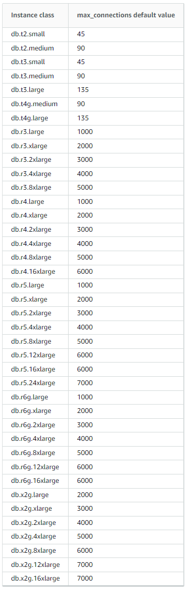

# RDS
Relational Database Service (RDS)

# Overview
- Amazon will restart an RDS database after 7 days.
- Hourly billing
- DB Connections
- [Max Connections](https://docs.aws.amazon.com/AmazonRDS/latest/AuroraUserGuide/AuroraMySQL.Managing.Performance.html)

